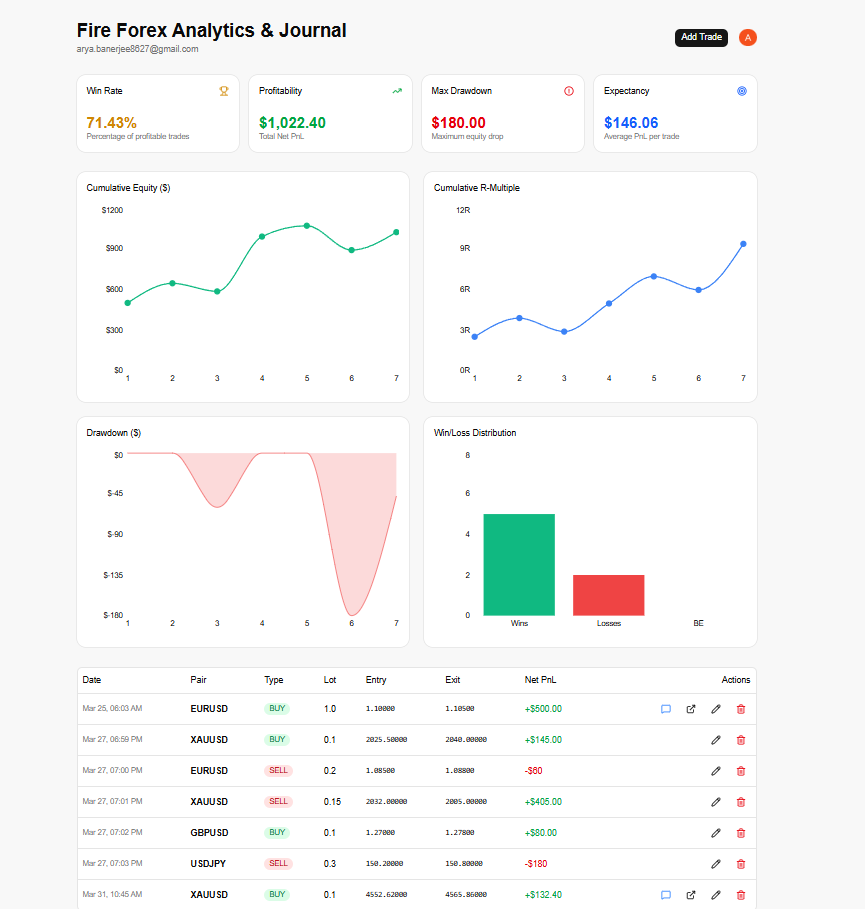
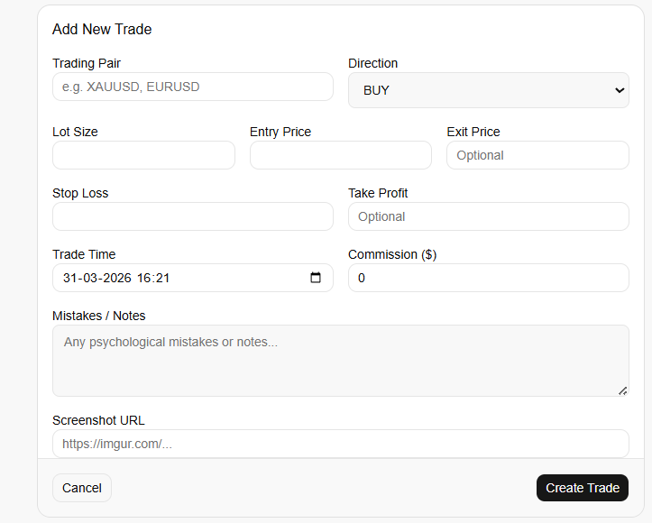
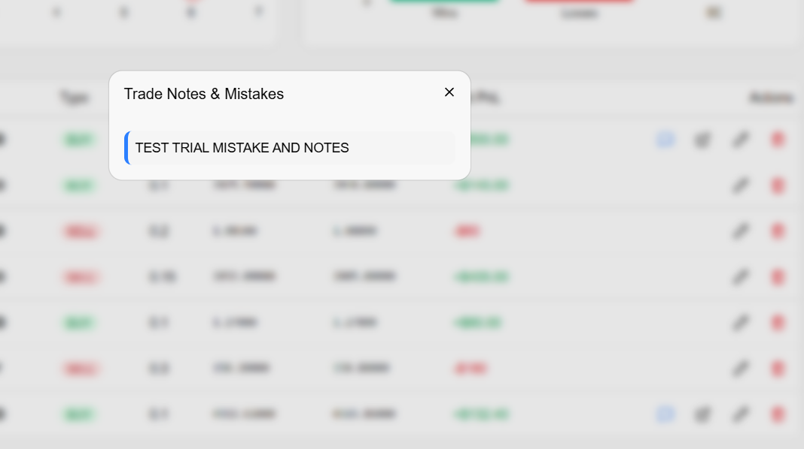
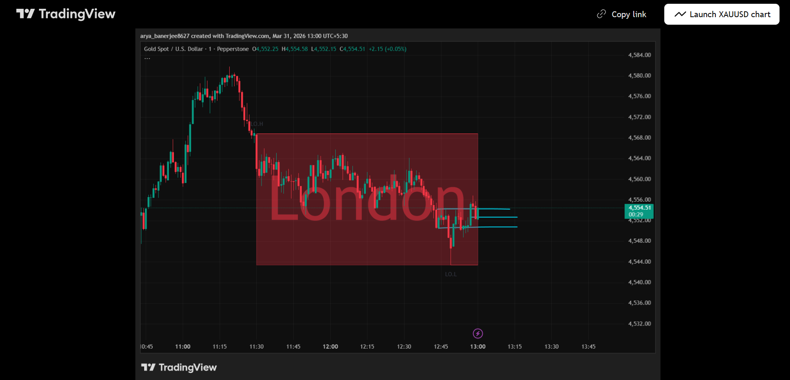

# 📝 Fire Forex Analytics & Journal (v3.0)

**Fire Forex Analytics & Journal** is a high-performance, full-stack trading companion designed for modern Forex and Gold (XAU) traders. It goes beyond simple logging by providing automated PnL calculations, risk analysis, and visual performance dashboards.

---

## 🚀 Live Demo
- **Frontend:** [https://trading-journal-frontend-rust.vercel.app/](https://trading-journal-frontend-rust.vercel.app/)
- **API Documentation:** [https://trading-journal-api-lgkz.onrender.com/docs](https://trading-journal-api-lgkz.onrender.com/docs)

---

## 📸 Project Showcase

### **Dashboard Overview**
> *Analyze your equity curve, win rate, and expectancy at a glance.*
 

### **Trade Logging & Notes**
> *Log trades with precision, including screenshot URLs and psychological notes.*
 

### **Quick Analysis View**
> *Review your trade mistakes and notes instantly without leaving the list.*

> 
### **Chart Screenshot URL**
> *See the screenshot of the registered trade by accessing the given url (eg: from TradingView).*
 
---

## ✨ Key Features

- **Automated PnL Engine:** Automatically detects instrument types (Gold vs. Forex) and JPY pairs to apply correct pip multipliers.
- **Advanced Analytics:** Real-time calculation of Win Rate, Expectancy, and Max Drawdown.
- **Visual Equity Curve:** Dynamic charts powered by `Recharts` to track account growth.
- **Secure Auth:** Enterprise-grade authentication via **Clerk**.
- **Screenshot Integration:** Link your TradingView or Lightshot analysis directly to every trade.
- **Modern UI:** Built with **Tailwind CSS 4.2** and **Shadcn UI** using a perceptually uniform **OKLCH** color system.

---

## 🛠️ The Tech Stack

### **Frontend**
- **React 19** + **Vite 8**
- **Tailwind CSS 4.2** (CSS-first configuration)
- **Shadcn UI** (@base-ui/react primitives)
- **Lucide React** (Icons) & **Geist** (Typography)
- **Recharts** (Data Visualization)

### **Backend**
- **FastAPI** (High-performance Python framework)
- **SQLAlchemy** (ORM) & **PostgreSQL** (Hosted on Supabase)
- **Pydantic v2** (Data Validation)
- **python-jose** (JWT logic for Clerk integration)

---

## ⚙️ Core Logic: The Math

The app handles complex financial calculations in `Backend/app/service.py`:
- **Gold (XAU):** Uses a `100` multiplier.
- **JPY Pairs:** Uses a `1000` multiplier.
- **Standard Forex:** Uses a `100,000` multiplier.
- **Formula:** `PnL = (Exit - Entry) * Multiplier * Lot Size - Commissions`
- **R-Multiple:** Automatically calculates reward-to-risk ratio based on your Stop Loss.

---

## 👤 Author

**Arya Banerjee**
*Aspiring Coder*

This is my **first-ever deployed full-stack project**. It represents my journey into modern web development, combining complex financial logic with a polished user experience.

- **GitHub:** [aryabanerjee8627-hash](https://github.com/aryabanerjee8627-hash)

---
*Built for traders, by a trader.* 📈🔥
